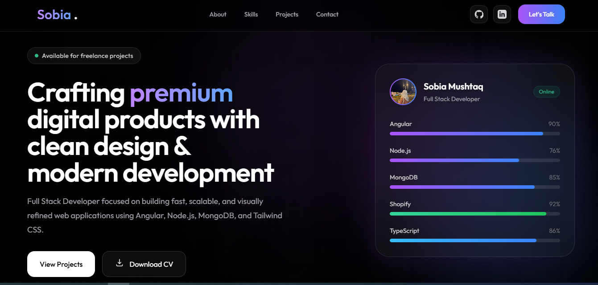
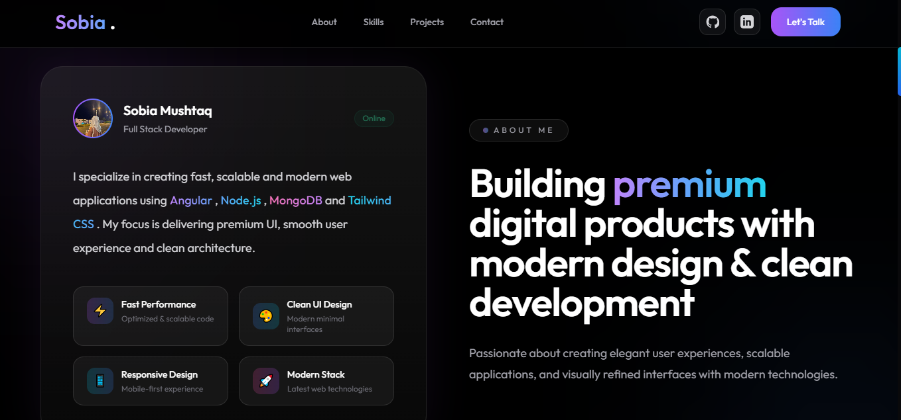
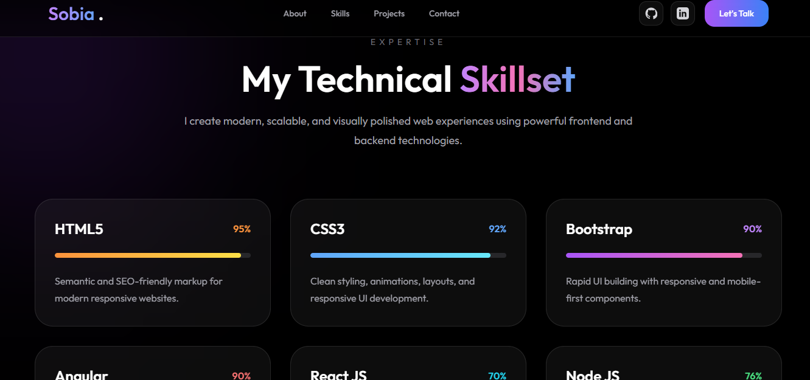
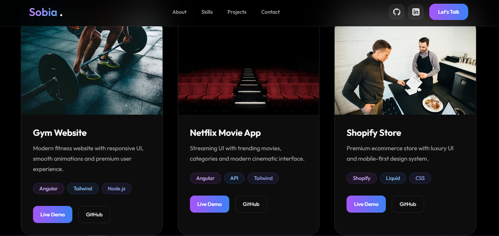
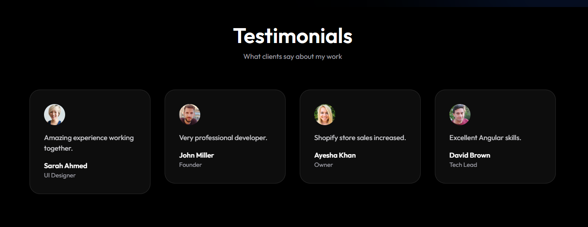
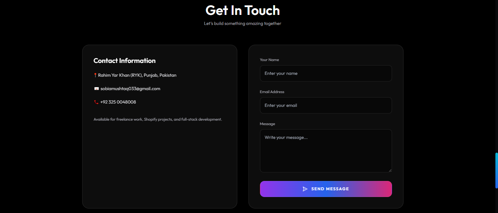
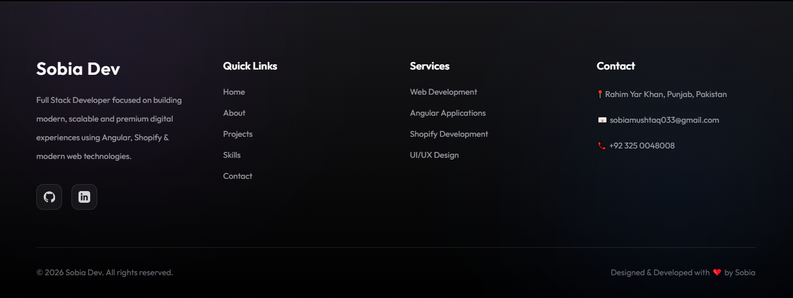

# 🚀 Sobia Portfolio

A modern, responsive personal portfolio built with **Angular** and **Tailwind CSS**.  
Showcasing my skills, projects, and professional journey in a clean UI.

---

## 🌐 Live Demo
> Add your deployed link here (Vercel / Netlify / Hosting)

---

## ✨ Features

- Fully responsive design (mobile + desktop)
- Smooth section-based navigation
- Hero section with intro
- About section
- Skills showcase
- Projects gallery
- Testimonials section
- Contact form section
- Clean footer design
- Optimized UI with Tailwind CSS

---

## 🛠️ Tech Stack

- Angular
- TypeScript
- Tailwind CSS
- HTML5
- SCSS
- Git & GitHub

---

## 📁 Project Structure

> Add your project structure here if needed

---

## 📸 Screenshots

### 🏠 Hero Section


### 👩‍💼 About Section


### 🧠 Skills Section


### 💼 Projects Section


### 💬 Testimonials Section


### 📩 Contact Section


### 🔻 Footer


---

## ⚙️ Setup & Installation

```bash
git clone https://github.com/your-username/portfolio.git

Install dependencies:
npm install

Run the project:
ng serve


👩‍💻 Author
Sobia
Frontend Developer | Angular Enthusiast | UI Lover
